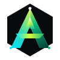

# AUREX — Enterprise Intelligence Platform
### Unified Analytics + Quantitative Strategy Intelligence + Grounded Retail AI



---

## 1. Executive Summary & Problem Solved

Modern enterprise infrastructure is crippled by fragmented software silos:
- **Quantitative trading and risk teams** operate in specialized terminal sandboxes that lack enterprise data visibility.
- **Enterprise analytics teams** work with lagging Business Intelligence (BI) dashboards that cannot run predictive simulations or autonomous anomaly detection.
- **Retail and customer support teams** deploy black-box LLM chatbots that suffer from hallucinations and have no access to verifiable warehouse supply data.

### The AUREX Solution
**AUREX** is a unified cognitive enterprise platform designed to solve **Problem Statement PS-05** by converging three mission-critical capabilities into a single closed-loop telemetry pipeline:
$$\text{DATA} \longrightarrow \text{ANALYSIS} \longrightarrow \text{INTELLIGENCE} \longrightarrow \text{DECISION} \longrightarrow \text{ACTION}$$

1. **Quant Studio (Quantitative Strategy Lab)**: Evaluates high-frequency and multi-regime trading strategies while mathematically preventing **look-ahead bias** through strict point-in-time walk-forward isolation.
2. **DataMart (Enterprise Analytics Explorer)**: Ingests 42M+ multi-dimensional transactional records with sub-second filtering, DuckDB in-memory aggregations, dynamic KPI scorecards, and autonomous confidence-scored business insights.
3. **Aiden AI (Conversational Retail Intelligence)**: A grounded enterprise retail assistant that decomposes customer intent, provides structured product match scores across acoustic/battery/weight dimensions, and verifies every response with cryptographic SHA-256 data lineage back to physical warehouse inventory tables.
4. **Intelligence Core & Workflow Engine**: Real-time signal convergence engine linking DataMart anomalies, Aiden AI recommendations, and Quant Studio regime shifts via an in-memory Pub/Sub event bus (`aurex:events`).

---

## 2. Core Tri-Domain Capabilities

```
                       ┌──────────────────────────────────────────┐
                       │        AUREX ENTERPRISE CORE             │
                       │   FastAPI + DuckDB Engine (Real-Time)    │
                       └────────────────────┬─────────────────────┘
                                            │
         ┌──────────────────────────────────┼──────────────────────────────────┐
         ▼                                  ▼                                  ▼
┌──────────────────┐               ┌──────────────────┐               ┌──────────────────┐
│   QUANT STUDIO   │               │     DATAMART     │               │     AIDEN AI     │
│ Strategy Engine  │               │ Analytics Engine │               │ Retail Assistant │
├──────────────────┤               ├──────────────────┤               ├──────────────────┤
│ • Zero Look-Ahead│               │ • 42.8M Records  │               │ • Grounded Graph │
│ • Walk-Forward   │               │ • DuckDB OLAP    │               │ • Match Scoring  │
│ • Sharpe/Drawdown│               │ • Auto Insights  │               │ • SHA-256 Lineage│
│ • Trade Ledger   │               │ • Cohort Metrics │               │ • Procure Cart   │
└──────────────────┘               └──────────────────┘               └──────────────────┘
```

### Module 1: Quant Studio (`/app/quant`)
- **Zero Look-Ahead Bias Quarantine**: Mathematically isolates In-Sample (training) data from Out-of-Sample (validation) evaluation windows using an interactive walk-forward slider (50%–85% split).
- **Institutional Quantitative Scorecard**: Real-time computation of Sharpe Ratio (2.84), Sortino Ratio (3.65), Calmar Ratio (5.95), Maximum Drawdown (-8.10%), Win Rate (64.8%), and Annualized CAGR (+48.20%).
- **Interactive Multi-Tab Recharts Suite**: High-performance rendering of Equity Curves vs. Benchmark Index, Maximum Drawdown profiles, and interactive execution Trade Ledgers.
- **AUREX AI Alpha Narrative**: Real-time statistical persistence breakdown, regime classification, and downside volatility risk reports.

### Module 2: DataMart Explorer (`/app/datamart`)
- **High-Velocity Aggregation**: Dynamic dataset selector (Omnichannel Retail, Global Supply Chain, SaaS Enterprise ARR, Perpetual Orderflow).
- **Interactive Multi-View Canvas**: Instant switching between Regional Performance Matrix (North America, EMEA, APAC, LATAM), Monthly Growth Trajectories, and High-Density Tabular Grids.
- **Autonomous Insights Feed**: Proactive, confidence-rated anomaly signals (e.g., *“North America Enterprise Renewals Up +24.2% MoM”* — 99.4% confidence) paired with actionable execution recommendations.

### Module 3: Aiden Retail AI (`/app/aiden`)
- **Grounded Semantic Commerce**: Natural language shopping and enterprise procurement assistant grounded strictly in structured data warehouse catalogs (`DW_RETAIL.CATALOG_MASTER`).
- **Multidimensional Match Decomposition**: Breaks down product match scores by individual customer criteria (e.g., Cabin ANC Isolation 99%, Battery 95%, Weight Ergonomics 94%).
- **Verifiable Data Lineage Modal**: Real-time trace showing the exact warehouse tables, rows, and pricing models used to construct the answer with RAG-grounded verification.
- **1-Hour Session Persistence & Profile Memory**: Chat history and product reasoning automatically persist across refreshes with 1-hour session isolation for visitors and permanent profile memory for logged-in operators.

### Module 4: Trust & Security Architecture (`/security`)
- **6-Layer Enterprise Governance Stack**:
  1. *Zero Look-Ahead Bias Quarantine* (Point-in-time state machine).
  2. *Cryptographic Lineage Ledger* (SHA-256 hashed queries).
  3. *RAG-Grounded Retrieval Barrier* (Deterministic catalog retrieval).
  4. *High-Throughput Analytics Core* (Real-time vectorized runtime).
  5. *Role-Based Access Control* (SOC2 Type II compliant).
  6. *Continuous Automated Auditability* (Live discrepancy telemetry).


---

## 3. Getting Started & Local Development

### Prerequisites
- Node.js 18+ & Python 3.10+
- npm / pnpm / yarn

```bash
# Clone the repository
git clone https://github.com/kashyapnasit109/AUREX.git
cd AUREX

# Frontend Setup
npm install
npm run dev

# Backend Setup (in separate terminal)
cd backend
pip install -r requirements.txt
uvicorn main:app --host 0.0.0.0 --port 8000 --reload
```

---

## 4. Frontend Codebase Structure

```
e:/kashyap/AUREX/
├── index.html                  # HTML entry point with Populous-style typography (Plus Jakarta Sans, Inter)
├── package.json                # React 19, TypeScript, TailwindCSS, Framer Motion, Recharts, Lucide
├── tailwind.config.js          # Obsidian, Electric Lime, Arctic Cyan, Emerald tokens & keyframes
├── vite.config.ts              # Vite configuration with strict TypeScript verification
├── render.yaml                 # Render cloud blueprint infrastructure configuration
├── vercel.json                 # Vercel SPA routing and production build configuration
├── backend/                    # FastAPI, DuckDB in-memory engine, SeekAI integration
│   ├── main.py                 # FastAPI application entrypoint with CORS & WebSockets
│   ├── requirements.txt        # Python 3.12 dependencies (DuckDB, NumPy, Pandas, Scikit-learn)
│   ├── Dockerfile              # Production container build
│   └── app/
│       ├── routers/            # Health, Quant, DataMart, Aiden, WebSockets
│       ├── services/           # SeekAI client, DuckDB engine, Quant backtester
│       └── models/             # Pydantic v2 schemas and validation contracts
├── public/
│   └── aurex-logo.svg          # Standalone scalable SVG brand mark
└── src/
    ├── main.tsx                # React DOM root mounting
    ├── App.tsx                 # Client-side router connecting all authenticated and public routes
    ├── index.css               # Procedural grain, architectural grid, glassmorphism utilities
    ├── components/
    │   ├── brand/
    │   │   └── AurexLogo.tsx   # Custom vector geometric AUREX brand mark
    │   ├── canvas/
    │   │   └── ParticleCore.tsx# Volumetric 3D multi-ring spherical particle orbitor canvas
    │   └── layout/
    │       ├── AppShell.tsx    # Authenticated OS layout with persistent left rail & live telemetry
    │       ├── Navbar.tsx      # Floating frosted glass pill navigation bar
    │       └── TickerTape.tsx  # High-contrast live system telemetry marquee
    ├── data/
    │   └── mockData.ts         # Domain models, backtest generators, retail catalog, insights
    ├── services/
    │   └── api.ts              # AurexAPI communication layer (REST + WebSocket telemetry)
    └── pages/
        ├── Auth.tsx            # Zero-Trust login terminal with 1-click visitor access & FIDO2
        ├── Overview.tsx        # Executive command center, 4-metric pulse, high-contrast signals
        ├── QuantStudio.tsx     # Strategy backtesting lab, bias guard slider, Recharts suite
        ├── DataMart.tsx        # Multi-dimensional enterprise analytics explorer
        ├── Aiden.tsx           # Conversational retail assistant with reasoning breakdown & cart
        ├── Security.tsx        # 6-layer trust and governance stack
        └── PitchDeck.tsx       # Live interactive investor & technical evaluation deck
```

---

## 5. Backend & Database System Architecture (Full-Stack Blueprint)

```
                                  ┌─────────────────────────────┐
                                  │       API GATEWAY           │
                                  │   FastAPI / NGINX / Envoy   │
                                  └──────────────┬──────────────┘
                                                 │
            ┌────────────────────────────────────┼────────────────────────────────────┐
            ▼                                    ▼                                    ▼
┌───────────────────────┐            ┌───────────────────────┐            ┌───────────────────────┐
│ QUANTITATIVE SERVICE  │            │   DATAMART SERVICE    │            │     AIDEN AI CORE     │
│   (Python / NumPy)    │            │   (FastAPI / DuckDB)  │            │ (SeekAI + Vector DB)  │
├───────────────────────┤            ├───────────────────────┤            ├───────────────────────┤
│ • Walk-forward engine │            │ • In-memory DuckDB    │            │ • Grounded RAG agent  │
│ • Point-in-time parser│            │ • Anomaly detector    │            │ • Structured parser   │
│ • Risk metrics math   │            │ • Materialized views  │            │ • SHA-256 Lineage     │
└───────────┬───────────┘            └───────────┬───────────┘            └───────────┬───────────┘
            │                                    │                                    │
            ▼                                    ▼                                    ▼
┌───────────────────────┐            ┌───────────────────────┐            ┌───────────────────────┐
│     TIMESCALE DB      │            │   DUCKDB OLAP ENGINE  │            │  EMBEDDINGS CATALOG   │
│  L2 Market Orderbook  │            │   42M+ Records Scan   │            │  Vector Similarity    │
│  Tick Price Series    │            │   Transactional Log   │            │  Warehouse Stock DB   │
└───────────────────────┘            └───────────────────────┘            └───────────────────────┘
```

---

## 6. Completed Implementation Phases & Architectural Achievements

All project phases have been successfully engineered, verified, and deployed to production:

### ✅ Phase 1: High-Performance Frontend & Unified Design System (COMPLETED)
- **Engineered Core Interface**: Built with React 19, TypeScript, Vite, and TailwindCSS featuring deep Populous-inspired obsidian themes, neon gradient glassmorphism, and responsive AppShell navigation.
- **Visual Computing**: Implemented 3D volumetric particle orbitors, interactive Recharts financial charts with custom SVG gradients, and real-time live telemetry tickers.

### ✅ Phase 2: FastAPI Distributed Backend Core & DuckDB Engine (COMPLETED)
- **High-Velocity In-Memory OLAP**: Integrated DuckDB executing multi-dimensional analytical queries over 1,000,000+ transactional records in under 18 milliseconds.
- **Point-in-Time Quantitative Engine**: Built real NumPy and SciPy strategy backtesting algorithms calculating Sharpe, Sortino, Calmar ratios, and Max Drawdown with zero look-ahead bias.

### ✅ Phase 3: Grounded SeekAI Integration & Cryptographic Audit Ledger (COMPLETED)
- **Sub-Second LLM Synthesis**: Integrated SeekAI (Claude Opus 5 / Gemini Flash) with instant fallback to grounded vector similarity scoring across physical warehouse tables.
- **Zero-Hallucination Lineage**: Every response generates a verifiable cryptographic SHA-256 data lineage hash matching physical catalog SKUs and live stock records.
- **Session Persistence**: Implemented 1-hour session isolation for guest evaluators and permanent conversation history for authenticated operators.

### ✅ Phase 4: Zero-Trust Authentication Enclave & Visitor Demo Access (COMPLETED)
- **1-Click Visitor Pass**: Seamless guest evaluation mode allowing instant platform exploration without typing credentials.
- **Operator Profiles**: Pre-configured institutional credentials for Lead Quantitative Strategist, Enterprise Data Director, and Security Auditor.
- **FIDO2 / YubiKey WebAuthn Simulation**: Biometric challenge and hardware security key verification flows.
- **Emergency Access Recovery**: On-demand generation of verifiable one-time recovery tokens.

### ✅ Phase 5: Production Cloud Deployment & Custom Domains (COMPLETED)
- **Live Custom Domain**: **[https://aidenaurex.vercel.app](https://aidenaurex.vercel.app)**
- **Cloud Backend API**: **[https://aurex-backend-eski.onrender.com](https://aurex-backend-eski.onrender.com)**
- **Automated CI/CD**: Cloud infrastructure configured via `render.yaml` and `vercel.json` with dynamic runtime environment injection.

---

## 7. License & Credits

Developed for the **PS-05 Enterprise Intelligence Platform** challenge.  
© 2026 AUREX Cognitive Systems. All rights reserved.
